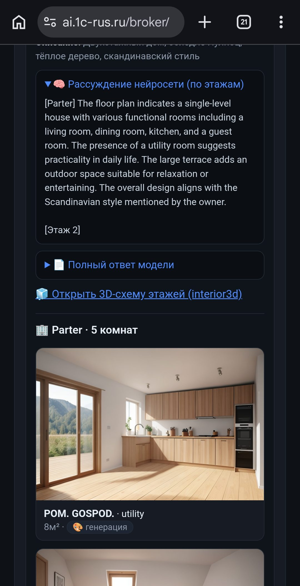
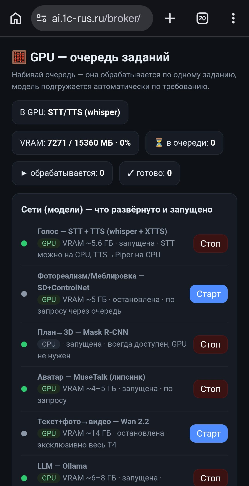
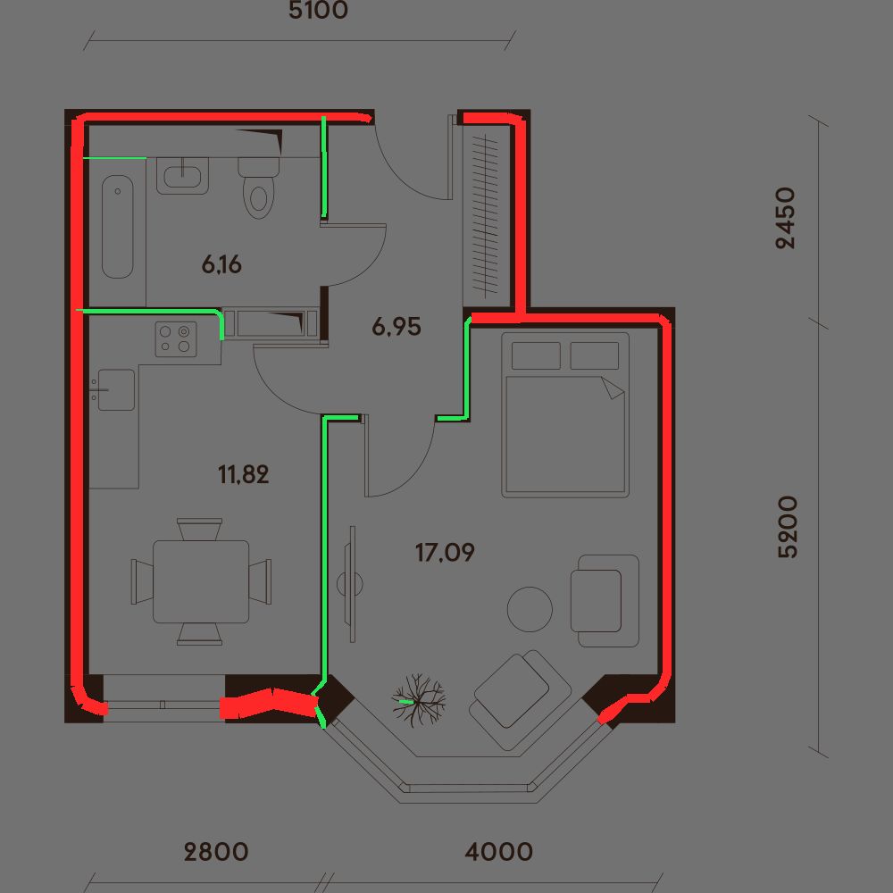
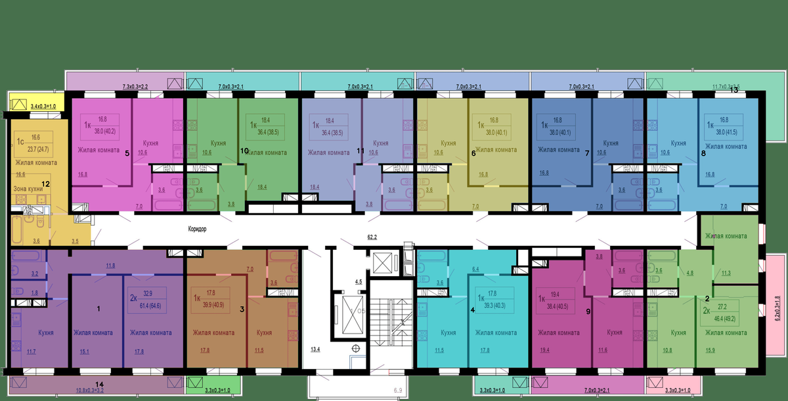
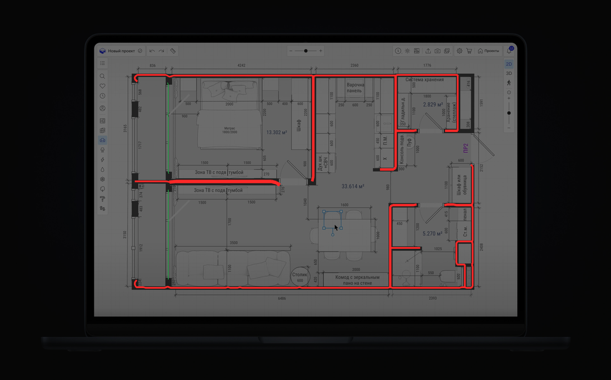
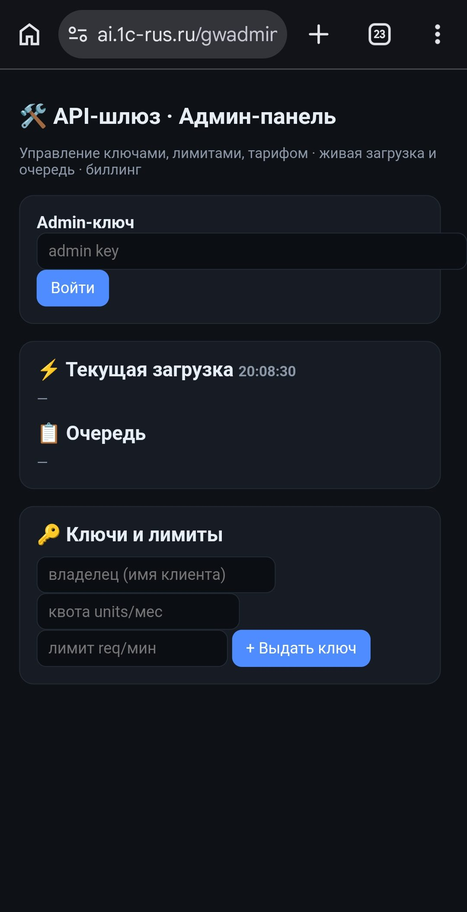
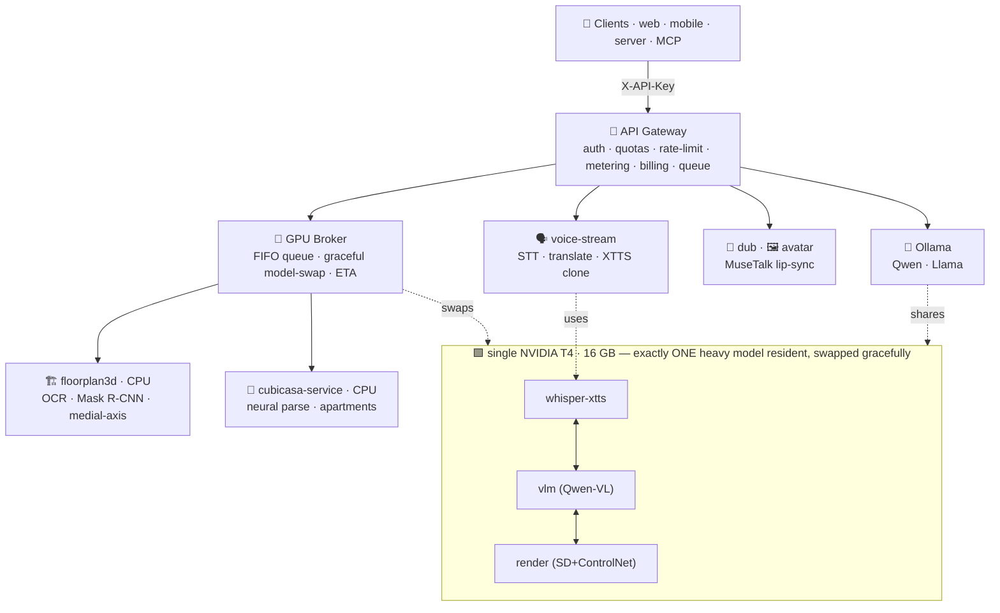

<div align="center">

# 🧠 ai-media-stack

**A self-hosted, multi-tenant AI media platform — runs a whole fleet of generative services on a single GPU.**

Floor-plan → 3D · live voice-to-voice translation in your own voice · video dubbing with lip-sync ·
talking avatars · on-box LLMs — all behind one **GPU job-broker** with automatic model-swapping,
and one **API gateway** with keys, per-key metering, quotas and billing.


**[What’s new →](CHANGELOG.md)**

</div>

---

## Why this exists

Running many heavy AI models usually means many GPUs. This stack squeezes **a full product suite onto one
16 GB GPU** by treating the GPU as a scheduled resource: a **broker** keeps exactly one heavy model resident,
swaps models gracefully between jobs (never `kill -9`, never touches other tenants), and exposes live
queue/ETA. On top sits a **REST API gateway** that turns every service into a metered, multi-tenant product —
API keys, monthly quotas, rate limits, usage accounting and billing — with a clean admin dashboard.

It’s a complete, opinionated reference for **how to ship multiple GPU AI services as one coherent platform.**

## ✨ Features

| Domain | What it does |
|---|---|
| 🏗️ **Floor-plan → 3D** | Upload a plan (or photos) → typed rooms, walls (any angle/curve via medial-axis), doors/windows, apartments on multi-unit floors, true scale from printed dimensions, a saved/linkable Three.js 3D scene + render library. |
| 🌍 **Translation API** | Multilingual machine translation behind one key — **single / batch (≤200) / many-languages-at-once**, source **auto-detect**, and a choice of models (**EuroLLM-9B**, **TranslateGemma-12B**, Qwen, Llama). Concurrent: 8-way parallel, ~3 translations/sec on one GPU. |
| 🗣️ **Live voice translation** | Stream from the mic → STT → translate → speak back **in your own cloned voice** in another language, near-real-time. Voice library (save/select) + 58 built-in voices with flags & gender. |
| 🎥 **Video dubbing** | Short clip → translate → your voice → **lip-sync** (MuseTalk). |
| 🖼️ **Talking avatars** | Photo + text → talking-head video. |
| 🤖 **On-box LLMs** | Qwen / Llama / EuroLLM / TranslateGemma via the gateway (`/v1/llm/chat`, `/v1/translate`), token-metered. |
| 🧮 **GPU broker** | One heavy model resident on the T4, graceful auto-swap, single FIFO queue, live position/ETA — translation and voice **coexist**, heavy 3D/render jobs swap on demand. |
| 🔐 **API gateway** | API-key auth, per-key usage + tokens, **monthly quotas (402)**, **rate limits (429)**, billing, audit log. |
| 🛠️ **Admin control panel** | Tabbed, mobile-first: live GPU/queue/system monitoring, **start/stop/restart every service**, keys & billing, a launchpad to open the tools, and **add models** (Ollama pull) on the fly. |
| 📹 **Video surveillance (VMS)** | RTSP cameras → **person-triggered clip recording** (pre/post-roll), a live MJPEG monitoring grid, events history with playback, and **face recognition** (SCRFD + ArcFace + FAISS) that attaches an identity to each event. |
| 🎨 **Creative media tools** | Object removal from photos (IOPaint — LaMa + SAM2) and short-video generation (Wan via ComfyUI), deployed behind the same SSO + gateway. |

## 📸 Screenshots

| Floor-plan → 3D + photoreal render | GPU broker — live model-swap & queue |
|:--:|:--:|
|  |  |
| *Neural reasoning per floor → typed rooms → photoreal per-room renders.* | *One T4: which model is resident, VRAM, queue, start/stop per service.* |

| Wall vectorization (load-bearing vs partition) | Apartment segmentation (multi-unit floor) |
|:--:|:--:|
|  |  |
| *Medial-axis walls of any angle/curve; 🔴 load-bearing, 🟢 partition.* | *Each apartment auto-detected & outlined on a building floor.* |

| Full wall network from a raster plan | API admin — keys · limits · billing · load |
|:--:|:--:|
|  |  |
| *Walls extracted 1:1 from the drawing (frame/noise rejected).* | *Issue keys, set quotas/rate-limits, watch load & queue, see billing.* |

## 🏛️ Architecture



## 📦 Services

| Service | Port | Role |
|---|---|---|
| [`api-gateway`](services/api-gateway) | 8190 | Multi-tenant REST: auth, metering, quotas, billing, admin UI |
| [`gpu-broker`](services/gpu-broker) | 8092 | GPU job queue + graceful model-swap + the 3D pipeline orchestrator |
| [`voice-stream`](services/voice-stream) | 8202 | Live mic → translated speech in a cloned/preset voice |
| [`dub-web`](services/dub-web) | 8200 | Webcam/clip → dubbed, lip-synced video |
| [`animate-web`](services/animate-web) | 8201 | Photo + text → talking avatar |
| [`interior3d-web`](services/interior3d-web) | 8203 | Floor-plan → 3D test console |
| [`control-plane`](services/control-plane) | 8090 | Ops dashboard (services, GPU, system) |
| [`floorplan3d`](services/floorplan3d) | 8204 | CPU wrapper: OCR + Mask-R-CNN + medial-axis wall vectorization |
| [`cubicasa-service`](services/cubicasa-service) | 8205 | CPU wrapper: neural plan parsing (walls/rooms/doors/windows) + colour-based apartments |
| [`vms`](services/vms) | 8120 | Video Management System: RTSP cameras, person-triggered recording, live grid, face recognition |

> Also integrated behind the gateway (third-party stacks, deployed not vendored): **IOPaint** (object
> removal), **Wan/ComfyUI** (video generation), **Open WebUI** (chat), **Ollama** (model backend),
> and **SD + ControlNet** render for the 3D pipeline.

## 🌟 Engineering highlights

- **One GPU, many products.** A broker treats the T4 as a scheduled resource — exactly one heavy model
  resident, swapped **gracefully** (`docker stop/start` + `ollama stop`, never `kill -9`), with a single
  FIFO queue and rolling-average ETA. Other tenants on the box are never touched.
- **Multi-tenant from day one.** One API key spans every service; per-key **metering** (requests, weighted
  units, LLM tokens), **monthly quotas → 402**, **rate limits → 429**, append-only billing audit log, and a
  live admin dashboard — limits apply on the *very next* request, no restart.
- **Hybrid CV + neural floor-plan understanding.** A VLM reads *every* label/dimension; a multi-source
  **scale solver** (dimension chains with outlier rejection + printed areas) fixes OCR misreads; a
  **medial-axis vectorizer** captures walls of any angle/curve/thickness and classifies load-bearing vs
  partition; colour-based **apartment segmentation** handles multi-unit floors.
- **Real-time voice-to-voice in your own voice.** Browser VAD → Whisper → LLM translate → XTTS clone,
  streamed utterance-by-utterance with a voice library + 58 preset speakers.
- **One GPU, gracefully shared.** Translation (EuroLLM) and voice (Whisper) co-reside on a 16 GB T4;
  heavy 3D/render jobs swap the translation model out on demand and restore it when idle. Concurrent
  translation requests are served in parallel and **fail-fast under contention** instead of piling up —
  the API stays responsive even when an external client bursts.
- **Face-anchored cross-camera re-identification.** Identities are built *purely from cameras* (no manual
  enrollment): face (SCRFD + ArcFace) is the cross-day anchor, with a **multi-view, pose-bucketed gallery**
  (signed yaw from the landmarks → frontal/left/right exemplars) for angle-invariant matching; clothing
  (OSNet-AIN) is a within-session helper only; matching is class-scoped (people, vehicles, objects). A faceless
  back-view never fabricates a duplicate person — the design is **correct under the constraint that only faces
  carry identity**. See [ARCHITECTURE](docs/ARCHITECTURE.md).
- **Honest licensing.** Third-party models are integrated, not vendored — see [NOTICE](NOTICE.md).

## 🗺️ Roadmap

**Shipped**
- [x] Multilingual translation API — single / batch / many-languages, source auto-detect, model selection
- [x] Translation-tuned models (EuroLLM-9B, TranslateGemma-12B) + concurrent / broker-routed serving
- [x] Tabbed, mobile-first **admin control panel** — monitoring, service start/stop, keys & billing, model management
- [x] GPU orchestration that lets translation + voice **coexist**, heavy jobs swap on demand; concurrency-safe routing
- [x] **Video surveillance (VMS)** on the GPU — cross-camera, **face-anchored re-identification** with a
      multi-view pose-bucketed gallery, class-scoped object identification, and a face-first People analytics dashboard

**Next**
- [ ] **AdaFace** (quality-adaptive) face model for low-resolution camera faces; per-track best-frame selection
- [ ] MCP adapter (expose the gateway’s OpenAPI to AI agents via `mcpo`)
- [ ] Per-key invoice export (CSV/PDF) from the billing event log
- [ ] One-command `docker compose` for the whole stack
- [ ] Multi-GPU sharding (scale past a single T4); cached XTTS speaker latents
- [ ] Trained floor-plan parser fine-tune for non-coloured / CAD plans

## 🚀 Quickstart (one service)

```bash
git clone https://github.com/yakden/ai-media-stack
cd ai-media-stack/services/api-gateway
cp .env.example .env          # fill in your secrets
pip install fastapi uvicorn httpx
uvicorn app:app --host 127.0.0.1 --port 8190
```

Each service is a single-file FastAPI app (`app.py` / `serve*.py`) — read it top-to-bottom, the docstrings
explain the design. The two ML wrappers (`floorplan3d`, `cubicasa-service`) have Dockerfiles and their own
READMEs (they reference upstream model repos — weights are **not** bundled, see [NOTICE](NOTICE.md)).

## 🔌 API example (one key, many services)

```bash
# admin issues a key
curl -X POST https://host/gw/admin/keys -H "X-Admin-Key: $ADMIN" -F "owner=Acme" -F "quota_units=5000"

# client uses ONE key for everything, gets queue position + ETA back
curl -X POST https://host/gw/v1/3d/project -H "X-API-Key: $KEY" -F "files=@plan.png"
#  → {"job_id":"…","queue":{"position":1,"ahead":0,"eta_seconds":42,"total_in_queue":1}}

curl     https://host/gw/v1/billing        -H "X-API-Key: $KEY"   # your usage + cost
```

### 🌍 Translation in one call

```bash
# single — pick a model, auto-detect the source
curl -X POST https://host/gw/v1/translate -H "X-API-Key: $KEY" -H "Content-Type: application/json" \
  -d '{"text":"Договор вступает в силу с момента подписания.","to":"English","model":"eurollm:9b","detect":true}'

# batch up to 200 rows in one request (migrate data from another system)
curl -X POST https://host/gw/v1/translate/batch -H "X-API-Key: $KEY" -H "Content-Type: application/json" \
  -d '{"to":"English","texts":["Заказ №123","Статус: оплачен","Адрес: Москва"]}'

# one text → many languages at once
curl -X POST https://host/gw/v1/translate/multi -H "X-API-Key: $KEY" -H "Content-Type: application/json" \
  -d '{"text":"Счёт оплачен","to":["English","German","Polish","Ukrainian"]}'
```

For maximum throughput, send **8 concurrent requests** with a connection-reusing client — the gateway
serves them in parallel (~3 translations/sec on a single T4). See [docs/API.md](docs/API.md).

## 🧩 Tech

FastAPI · Docker · NVIDIA T4 · PyTorch · TensorFlow · OpenCV · scikit-image · Three.js ·
Whisper · Coqui XTTS · MuseTalk · Mask R-CNN · CubiCasa5k · Ollama (Qwen / Llama / EuroLLM / TranslateGemma) ·
YOLOv8 · InsightFace (SCRFD + ArcFace) · FAISS · ONNX Runtime · ffmpeg · SAM2 · LaMa.

## 📜 License

This project’s **own code** is [MIT](LICENSE). Third-party models and datasets it integrates keep their own
licenses (some non-commercial) and are **referenced, not redistributed** — see [NOTICE](NOTICE.md).

> Built and maintained by [@yakden](https://github.com/yakden).
